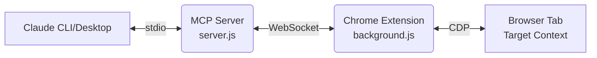

# 👻 Ghost Bridge

[](https://www.npmjs.com/package/ghost-bridge)
[](https://opensource.org/licenses/MIT)

> **Zero-restart Chrome AI Copilot** — Subvert your workflow. Allow AI to seamlessly take over the browser you're already using, enabling real-time debugging, visual observation, and interactive manipulation without launching a new Chrome instance.

---

## ✨ Why Ghost Bridge?

- 🔌 **Zero-Config Attach** — Bypasses the need for `--remote-debugging-port`. Captures Chrome's native DevTools Protocol directly via an extension.
- 🔍 **No-Sourcemap Debugging** — Slice code fragments, perform string searches, and analyze coverage to pinpoint bugs straight in minified production code.
- 🌐 **Deep Network Analysis** — Comprehensive capture of requests/responses with multi-dimensional filtering and response body inspection.
- 📸 **Visual & Structural Perception** — Full-page or clipped high-fidelity screenshots paired with structural data extraction (titles, links, forms, buttons).
- 🎯 **DOM Physical Manipulation** — Empowers AI to click, type, and form-submit with CDP-level physical simulation. Fully compatible with complex SPAs (React/Vue/Angular/Svelte).
- 📊 **Performance Diagnostics** — Get granular engine metrics: JS Heap, Layout recalculations, Web Vitals (TTFB/FCP/LCP), and resource loading speeds.
- 🔄 **Multi-Client Mastery** — Built-in singleton manager automatically coordinates multiple MCP clients sharing a single Chrome transport.

---

## 🚀 Quick Start

### 1. Install & Initialize

```bash
# Install globally
npm install -g ghost-bridge

# Auto-configure MCP (Claude Code, Antigravity, Codex) and prepare the extension directory
ghost-bridge init
```

> **Note on other MCP clients (Cursor, Windsurf, Roo):** 
> `ghost-bridge init` attempts to auto-configure supported clients. If your client isn't auto-detected, simply add the following to your client's MCP configuration file (e.g., `mcp.json`):
> ```json
> {
>   "mcpServers": {
>     "ghost-bridge": {
>       "command": "node",
>       "args": ["/absolute/path/to/global/node_modules/ghost-bridge/dist/server.js"]
>     }
>   }
> }
> ```

### 2. Load the Chrome Extension

1. Open Chrome and navigate to `chrome://extensions`
2. Toggle **Developer mode** in the top right corner.
3. Click **Load unpacked**
4. Select the directory: `~/.ghost-bridge/extension`

> 💡 *Tip: Run `ghost-bridge extension --open` to reveal the directory directly.*

### 3. Connect & Command

1. Click the **Ghost Bridge** ghost icon in your browser toolbar.
2. Click **Connect** and wait for the status to turn to ✅ **ON**.
3. Open Claude Desktop or your Claude CLI. All tools are now primed and ready!

---

## 🛠️ Tool Arsenal

### 🔍 Core Debugging

| Tool | Capability |
|------|------------|
| `get_server_info` | Retrieves server instance status, WebSocket ports, and client roles. |
| `get_last_error` | Aggregates recent exceptions, console errors, and failed network requests with mapped locators. |
| `get_script_source` | Pulls raw script definitions. Supports URL-fragment filtering, specific line targeting, and beautification. |
| `coverage_snapshot` | Triggers a quick coverage trace (1.5s default) to identify the most active scripts on the page. |
| `find_by_string` | Scans page script sources for keywords, returning a 200-character context window. |
| `symbolic_hints` | Gathers context clues: Resource lists, Global Variable keys, LocalStorage schema, and UA strings. |
| `eval_script` | Executes raw JavaScript expressions in the page context. *(Use with caution)* |

### 🌍 Network Intelligence

| Tool | Capability |
|------|------------|
| `list_network_requests` | Lists captured network traffic. Supports filtering by URL, Method, Status Code, or Resource Type. |
| `get_network_detail` | Dives deep into a specific request's Headers, Timing, and optional Response Body extraction. |
| `clear_network_requests` | Wipes the current network capture buffer. |

### 📸 Page Perception

| Tool | Capability |
|------|------------|
| `capture_screenshot` | Captures the viewport or emulates full-page scrolling screenshots. |
| `get_page_content` | Extracts raw text, sanitized HTML, or structured actionable data representations. |

### 🎯 Interactive Automation (DOM)

| Tool | Capability |
|------|------------|
| `get_interactive_snapshot` | Scans for visible interactive elements, returning a concise map `[e1, e2...]`. Pierces open Shadow DOMs. |
| `dispatch_action` | Dispatches physical UI actions (click, fill, press, hover) against targeted element references (e.g., `e1`). |

**Example Agent Workflow:**
1. AI: `get_interactive_snapshot` ➝ `[{ref:"e1", tag:"input", placeholder:"Search..."}, {ref:"e2", tag:"button", text:"Login"}]`
2. AI: `dispatch_action({ref: "e1", action: "fill", value: "hello"})`
3. AI: `dispatch_action({ref: "e2", action: "click"})`
4. AI: `capture_screenshot` to verify state changes.

### 📊 Performance Profiling

| Tool | Capability |
|------|------------|
| `perf_metrics` | Collects layered performance data (Engine Metrics, Web Vitals, and Resource Load Summaries). |

---

## ⚙️ Configuration

| Setting | Default | Description |
|---------|---------|-------------|
| **Base Port** | `33333` | WS port. Auto-increments if occupied. |
| **Token** | *Monthly UUID* | Local WS auth token, auto-rotates on the 1st of every month. |
| **Auto Detach** | `false` | Keeps debugger attached to actively buffer invisible exceptions and network calls. |

**Environment Variables:**
- `GHOST_BRIDGE_PORT` — Override base port.
- `GHOST_BRIDGE_TOKEN` — Override connection token.

---

## 🏗️ Architecture



- **MCP Server**: Spawned by Claude via standard I/O streams. Orchestrates WS connections.
- **Chrome Extension (MV3)**: Taps into `chrome.debugger` API. Utilizes an Offscreen Document to prevent WS hibernation.
- **Singleton Design**: If multiple agents spawn servers, the first becomes the master bridge while subsequent instances chain transparently as clients.

---

## ⚠️ Known Limitations

- **Service Workers Suspending**: MV3 background workers may suspend. We've built robust auto-reconnection logic, but prolonged inactivity might require re-toggling.
- **DevTools Conflict**: If you manually open Chrome DevTools (F12) on the target tab, `chrome.debugger.attach` may be rejected.
- **Beautify Overhead**: Beautifying massive single-line bundles is expensive; the server will auto-truncate overly large scripts.
- **Cross-Origin OOPIF**: Elements and errors deeply embedded in strict Cross-Origin Iframes might evade the primary debugger hook without further multi-target attach logic.

---

## 🤝 Contributing

Contributions, issues, and feature requests are welcome! 
Check out our [Contributing Guide](CONTRIBUTING.md) to get started building tools or improving the bridge.

## 📄 License

This project is [MIT](LICENSE) licensed.
