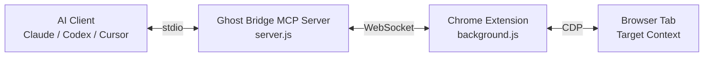

# 👻 Ghost Bridge

[](https://www.npmjs.com/package/ghost-bridge)
[](https://www.npmjs.com/package/ghost-bridge)
[](https://opensource.org/licenses/MIT)

> Zero-restart Chrome bridge for MCP clients. Let AI inspect, debug, and operate the browser session you are already using.

## Why

Most browser-capable AI tools start a separate browser. Ghost Bridge connects AI to your existing Chrome session instead, so it can work with the page state you already have: logged-in accounts, reproduced bugs, in-progress flows, network failures, and real UI state.

## What It Does

- Attach to Chrome without `--remote-debugging-port`
- Inspect page structure, text, screenshots, errors, and network traffic
- Search and extract script sources, even in production bundles
- Click, type, scroll, and submit forms on the current page
- Share one Chrome transport across multiple MCP clients

## What's New in 0.6.1

- `list_network_requests` and `get_network_detail` now summarize `data:` URLs and oversized URLs so inline images and long query strings do not overwhelm model context

## What's New in 0.6.0

- `inspect_page` now collects structured page data and interactive elements in one browser-side snapshot, reducing duplicate DOM scans and cutting one round-trip from the hot path
- `capture_screenshot` now defaults to JPEG for better transfer efficiency: visible viewport screenshots default to `quality: 80`, and `fullPage` screenshots default to `quality: 70`
- Use `format: "png"` when you need high-fidelity text rendering, 1px lines, icon edges, transparency, or pixel-level UI inspection
- Attachment and request cleanup paths are more robust under concurrent usage and multi-client reconnect scenarios

## Quick Start

### 1. Install

```bash
npm install -g ghost-bridge
ghost-bridge init
```

`ghost-bridge init` currently writes config for:

- Claude Code: `~/.claude/settings.json` or `~/.claude.json`
- Codex: `~/.codex/config.toml`
- Cursor: `~/.cursor/mcp.json`
- Antigravity: `~/.gemini/antigravity/mcp.json`

If your MCP client is not auto-detected, add one of these manually.

JSON config:

```json
{
  "mcpServers": {
    "ghost-bridge": {
      "command": "/absolute/path/to/node",
      "args": ["/absolute/path/to/global/node_modules/ghost-bridge/dist/server.js"]
    }
  }
}
```

Codex TOML:

```toml
[mcp_servers.ghost-bridge]
type = "stdio"
command = "/absolute/path/to/node"
args = ["/absolute/path/to/global/node_modules/ghost-bridge/dist/server.js"]
```

### 2. Load the Extension

1. Open `chrome://extensions`
2. Enable Developer mode
3. Click `Load unpacked`
4. Select `~/.ghost-bridge/extension`

You can also run:

```bash
ghost-bridge extension --open
```

### 3. Connect

1. Click the Ghost Bridge extension icon
2. Click `Connect`
3. Wait until the status becomes `ON`
4. Open your MCP client and start working on the current page

Typical prompts:

- `Analyze the current page`
- `Check why this layout is broken`
- `Inspect the DOM structure`
- `Click the login button and submit the form`

## Tools

| Tool | Purpose |
|------|---------|
| `inspect_page` | Default entry point for page analysis |
| `capture_screenshot` | Visual inspection and UI debugging |
| `get_page_content` | Text, HTML, and structured DOM extraction |
| `get_interactive_snapshot` | Find clickable and editable elements |
| `dispatch_action` | Click, fill, press, scroll, hover, select |
| `list_network_requests` | Inspect captured network traffic |
| `get_network_detail` | Read one request in detail |
| `get_last_error` | Inspect recent errors and exceptions |
| `get_script_source` | Extract page scripts |
| `find_by_string` | Search within bundled script content |
| `coverage_snapshot` | Identify active scripts quickly |
| `perf_metrics` | Collect Web Vitals and engine metrics |

Recommended flow:

1. Start with `inspect_page`
2. Use `capture_screenshot` for visual issues
   Default is optimized for transfer with JPEG; switch to `png` for pixel-level checks
3. Use `get_page_content` for DOM or text extraction
4. Use `get_interactive_snapshot` before `dispatch_action`

Notes:

- `list_network_requests` and `get_network_detail` automatically summarize `data:` URLs and very long URLs so inline images or oversized query strings do not overwhelm model context

## Configuration

| Setting | Default | Notes |
|---------|---------|-------|
| Port | `33333` | Set `GHOST_BRIDGE_PORT` to override |
| Token | Monthly UUID | Set `GHOST_BRIDGE_TOKEN` to override |
| Auto detach | `false` | Keeps debugger attached for ongoing capture |

## Architecture



## Limitations

- Chrome DevTools on the target tab can conflict with `chrome.debugger.attach`
- MV3 background lifecycle can still cause reconnect scenarios after long idle periods
- Very large minified bundles may be truncated during beautify or extraction
- Deep cross-origin iframe cases are not fully covered yet

## License

[MIT](LICENSE)
