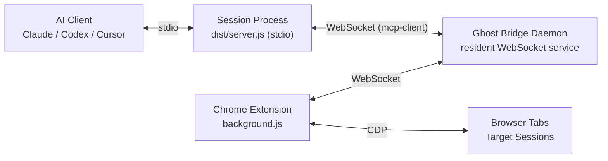

# 👻 Ghost Bridge

[](https://www.npmjs.com/package/ghost-bridge)
[](https://www.npmjs.com/package/ghost-bridge)
[](https://opensource.org/licenses/MIT)

> Zero-restart Chrome bridge for MCP clients. Let AI inspect, debug, and operate the browser session you are already using.

## Why

Most browser-capable AI tools start a separate browser. Ghost Bridge connects AI to your existing Chrome session instead, so it can work with the page state you already have: logged-in accounts, reproduced bugs, in-progress flows, network failures, and real UI state.

## What It Does

- Attach to Chrome without `--remote-debugging-port`
- Inspect page structure, text, screenshots, errors, and network traffic
- Search and extract script sources, even in production bundles
- Click, type, scroll, and submit forms on the current page
- Locate elements by role/name, label, placeholder, text, test ID, or CSS across open Shadow DOM and same-origin iframes
- Run `locate → act → wait → snapshot` as one browser call instead of model-driven polling
- Bind multiple Chrome tabs as named targets and operate them independently
- Share one Chrome transport across multiple MCP clients

## Quick Start

### 1. Install

```bash
npm install -g ghost-bridge
ghost-bridge init
```

`ghost-bridge init` currently writes config for:

- Claude Code: `~/.claude.json`
- Codex: `~/.codex/config.toml`
- Cursor: `~/.cursor/mcp.json`
- Antigravity: `~/.gemini/antigravity/mcp.json`

If your MCP client is not auto-detected, add one of these manually.

JSON config:

```json
{
  "mcpServers": {
    "ghost-bridge": {
      "command": "/absolute/path/to/node",
      "args": ["/absolute/path/to/global/node_modules/ghost-bridge/dist/server.js"]
    }
  }
}
```

Codex TOML:

```toml
[mcp_servers.ghost-bridge]
type = "stdio"
command = "/absolute/path/to/node"
args = ["/absolute/path/to/global/node_modules/ghost-bridge/dist/server.js"]
```

### 2. Load the Extension

1. Open `chrome://extensions`
2. Enable Developer mode
3. Click `Load unpacked`
4. Select `~/.ghost-bridge/extension`

You can also run:

```bash
ghost-bridge extension --open
```

### 3. Connect

1. Open your configured MCP client, or run `ghost-bridge start`, to start the service
2. Click the Ghost Bridge extension icon and click `Connect`
3. Wait until the status becomes `ON`
4. Start working on the current page from your MCP client

Typical prompts:

- `Analyze the current page`
- `Check why this layout is broken`
- `Inspect the DOM structure`
- `Click the login button and submit the form`

## Tools

| Tool | Purpose |
|------|---------|
| `inspect_page` | Compact page analysis, actionable refs, and shallow iframe summaries |
| `get_server_info` | Check client and daemon versions, paths, and connection status |
| `capture_screenshot` | Visual inspection and UI debugging |
| `get_page_content` | Text, HTML, and structured DOM extraction |
| `get_interactive_snapshot` | Find clickable and editable elements |
| `dispatch_action` | Locate, act, wait, and verify in one call; supports semantic locators and batches |
| `eval_script` | Execute JavaScript, wait for returned promises, and cap arbitrary output |
| `page_request` | Send an authenticated page-context request and wait for the response in one call |
| `bind_tab` | Bind a Chrome tab as a named target such as `cases` or `app` |
| `unbind_tab` | Remove a named target binding |
| `list_targets` | Show named targets and their per-tab session status |
| `pin_current_tab` | Keep Ghost Bridge attached to the current tab while you browse elsewhere |
| `pin_tab` | Pin a target tab by tab ID, URL fragment, or title fragment |
| `unpin_tab` | Return to following the focused tab |
| `get_target_tab` | Show the current target mode and tab |
| `list_tabs` | List available Chrome tabs |
| `list_network_requests` | Inspect captured network traffic |
| `get_network_detail` | Read one request in detail |
| `get_last_error` | Inspect recent console, exception, and network error events |
| `get_script_source` | Extract page scripts |
| `find_by_string` | Search within bundled script content |
| `symbolic_hints` | Collect resource and runtime clues for debugging |
| `clear_network_requests` | Clear captured network request records |
| `coverage_snapshot` | Identify active scripts quickly |
| `perf_metrics` | Collect Web Vitals and engine metrics |

Recommended flow:

1. When the target is describable, call `dispatch_action` directly with a semantic `locator`
2. Use `inspect_page` when the page is unfamiliar or a locator is ambiguous; its compact response includes actionable refs
3. Use `capture_screenshot` for visual issues
   Default is optimized for transfer with JPEG; switch to `png` for pixel-level checks
4. Use `get_page_content` for DOM or text extraction
5. Put consecutive fills/clicks into one `dispatch_action.actions` call; add `waitFor` to the action that changes state and `snapshotAfter` when the resulting UI is needed

Round-trip-efficient examples:

```json
{
  "target": "app",
  "actions": [
    {
      "locator": { "role": "textbox", "label": "Email" },
      "action": "fill",
      "value": "user@example.com"
    },
    {
      "locator": { "role": "textbox", "label": "Password" },
      "action": "fill",
      "value": "secret"
    },
    {
      "locator": { "role": "button", "name": "Sign in" },
      "action": "click",
      "waitFor": {
        "type": "element",
        "locator": { "text": "Signed in" },
        "state": "visible",
        "timeoutMs": 10000
      }
    }
  ],
  "snapshotAfter": true
}
```

Locator fields are `css`, `testId`, `role` + `name`, `label`, `placeholder`, `text`, `match`, and zero-based `nth`. Matching is exact by default. Ghost Bridge refuses ambiguous action targets and returns compact candidates instead of silently choosing the first element.

`waitFor` supports:

- `element`: `visible`, `hidden`, `attached`, `detached`, or `enabled`
- `url`: `contains` or `equals`
- `networkIdle`: optional `idleMs`
- `expression`: a truthy JavaScript expression, including a returned Promise

Polling happens inside the extension at a short interval, so it does not create repeated model/tool turns. Each condition defaults to 10 seconds and is capped at 30 seconds. The batch execution budget is capped at 60 seconds; deadline checks prevent subsequent actions from starting after it expires. An in-flight CDP command is not necessarily interrupted at that deadline. Fixed `waitMs` remains for compatibility but defaults to zero.

For API calls that need the page's login state, prefer `page_request`. If custom asynchronous JavaScript is still needed, return the promise from `eval_script` instead of storing a result on `window` and polling it in another tool call:

```javascript
(async () => {
  const response = await fetch('/api/items', { credentials: 'include' })
  const data = await response.json()
  return data.items.map(({ id, name }) => ({ id, name }))
})()
```

Notes:

- Use `bind_tab` when a workflow spans multiple pages. For example, bind a checklist page as `cases` and a business page as `app`, then call tools with `target: "cases"` or `target: "app"`.
- Page-scoped inspection and action tools accept an optional `target` parameter; tab listing, binding, and pinning tools manage targets separately. When named targets are bound, `dispatch_action` requires `target` so refs from one page are not accidentally used on another page.
- Semantic locators traverse open Shadow DOM and readable same-origin iframes. They do not traverse cross-origin iframe DOM. Text extraction can separately attempt bridge-based access as described below.
- `get_page_content` uses contiguous `offset`/`maxLength` slices for the main document and collected same-origin text. Cross-origin supplements are not part of that pagination stream.
- Use `pin_current_tab` when you are debugging a page and need to switch to other tabs without changing the AI target. Use `unpin_tab` to restore the original follow-focused-tab behavior.
- `list_network_requests` and `get_network_detail` automatically summarize `data:` URLs and very long URLs so inline images or oversized query strings do not overwhelm model context

Multi-page example:

```text
Bind the current checklist tab as cases.
Bind the tab whose title contains "Orders" as app.
Read the next case from target cases, operate target app, then mark the case passed or failed back on target cases.
```

## Iframe Summaries and Content Budgets

The compact `inspect_page` response shares an 8000-character budget across the page summary, iframe summaries, and interactive entries. It includes at most three iframe summaries in the selected scope, without reading their bodies by default. `framesOmitted` counts frames beyond that limit; `elementsOmitted` counts interactive entries removed to fit the budget. `detail:true` returns the full result without this compact budget. Character counts are not token counts.

When both structure and body text are needed for the same scope, request them together:

```json
{
  "target": "app",
  "includeText": true,
  "textMaxLength": 1500,
  "includeInteractive": false
}
```

This is an `inspect_page` call; bind `app` first or omit `target` to use the current target.
`includeText` defaults to false. When enabled, `text` contains the text result and iframe
budget fields, using the same selector as the summary. `textMaxLength` defaults to 1500
characters and is capped at 3000. Both reads share one page evaluation; cross-origin
supplements may require additional internal CDP calls. The compact response still shares
the 8000-character output budget and drops interactive entries first when necessary.
For longer text or pagination, use `get_page_content`. If the summary is needed to decide
which scope to read, keep those calls separate. Combining reads reduces external tool
calls; it does not change client approval settings or guarantee lower approval latency.

The iframe `readable` field is a string:

| Value | Meaning | Next step |
|-------|---------|-----------|
| `in-page` | `contentDocument` is accessible | Read through the page context |
| `via-bridge` | Inaccessible in-page, but has a source URL | Try `get_page_content`; bridge access is not guaranteed |
| `no` | Currently inaccessible and has no source URL | Check loading state before retrying |

Compare these strings explicitly: all three are truthy in JavaScript. An accessible blank iframe is still `in-page`. The index is the current DOM order within the selected scope, not a stable handle or a tool input for selecting a frame.

In text mode, `get_page_content` collects same-origin iframe text and attempts to append up to five discovered cross-origin iframe targets. Access depends on Chrome support and a target that can be attached. A `via-bridge` summary alone does not prove this target exists.

Cross-origin supplements use only the remaining `maxLength` budget, including `[跨域 iframe N]` labels and separators. When no space remains, the tool skips further reads:

- `crossOriginMerged`: frames whose body text was actually retained.
- `crossOriginBudgetSkipped`: candidate frames skipped because the budget was exhausted.
- `crossOriginTruncated`: a returned frame body was incomplete.
- `crossOriginFailed`: attempted frame reads that failed.

Supplements appear only at `offset=0`. `contentLength`, `offset`, and `hasMore` describe the main document and same-origin text stream, not cross-origin pagination. Cross-origin candidates come from tab-level debugger state and are not correlated with the supplied CSS `selector`; the tool does not currently provide a cross-origin frame selector. In particular, a long main document may leave no room for a supplement.

## Performance Diagnostics

Reduce repeated calls by using the action batches, `waitFor`, and `snapshotAfter` shown above. Prefer `page_request` for page-context requests, and reserve `eval_script` for logic the dedicated tools cannot express. Tool annotations describe capabilities; they do not grant permission or guarantee that a client skips approval.

With `GHOST_BRIDGE_DIAGNOSTICS=1`, the MCP session process writes `[ghost-timing]` JSON lines to stderr containing a request ID, command name, bridge duration, result character count, and failure status. These diagnostic lines do not contain scripts, page bodies, or authentication tokens. They are emitted on responses; a transport timeout may have no corresponding timing line.

With the updated extension, the `extension` field also reports `commandMs` and the extension version. Commands that attach include `attachSessionMs`, `lockMs`, and `resolveMs`; `eval_script` additionally includes `evaluateMs`. `attachSessionMs` includes lock waiting and target resolution: do not add them together. Older extensions omit these fields.

Bridge timing starts in the Ghost client when it dispatches a command. It does not measure preceding model generation or client approval. Compare it with caller-side elapsed time before deciding which part to optimize.

From a source checkout, run the local MCP benchmark:

```bash
npm run build
node scripts/benchmark-mcp.js /absolute/path/to/dist/server.js TAB_ID 5
```

Use a tab ID from `list_tabs`. The script creates an independent MCP session, binds that tab, and measures service status, a small read-only expression, and page inspection without interactive scanning. It reports client connection time, versions, sample durations, and result character counts, without page content. Use the same port, token, and temporary-directory environment as the real MCP client. A disconnected extension or stale tab ID causes the benchmark to fail.

This measures the local MCP path, not the client's approval system. The server entry can start a daemon if none is found. Reload the updated extension before collecting extension-stage timings; building Node files alone does not reload it.

## Configuration

| Setting | Default | Notes |
|---------|---------|-------|
| Port | `33333` | Set `GHOST_BRIDGE_PORT` to override |
| Token | `ghost-bridge-local` | `GHOST_BRIDGE_TOKEN` overrides the server token; the extension must use the same value |
| Auto detach | `false` | Extension configuration; keeps debugger attached for ongoing capture |
| Diagnostics | Off | Set `GHOST_BRIDGE_DIAGNOSTICS=1` in the MCP session process environment |

The extension token is currently set in `extension/background.js` (`CONFIG.token`); there is no popup token setting. Changing only the server environment will cause authentication failures.

## Architecture


```mermaid
flowchart LR
    A["AI Client<br/>Claude / Codex / Cursor"]
    S["Session Process<br/>dist/server.js (stdio)"]
    B["Ghost Bridge Daemon<br/>resident WebSocket service"]
    C["Chrome Extension<br/>background.js"]
    D["Browser Tabs<br/>Target Sessions"]

    A <-->|"stdio"| S
    S <-->|"WebSocket (mcp-client)"| B
    C <-->|"WebSocket"| B
    C <-->|"CDP"| D
```

The WebSocket service runs as a detached daemon, independent of any MCP session:

- The first session process spawns the daemon automatically; it keeps running after that session exits
- If the daemon crashes, any live session detects it and respawns it automatically
- Stop it manually with `ghost-bridge stop` (close live MCP sessions first, otherwise they will bring it back on their next reconnect)

## Troubleshooting

If the popup shows `No Bridge` / `Not Found`, the extension could not find a service on its configured port. Start a configured MCP client or run `ghost-bridge start`, then reconnect the extension. Reconnecting the extension alone does not start the Node daemon.

Run `ghost-bridge status` and check:

- `Active WebSocket Service`: the running server path should match the CLI/package you expect
- `Chrome Extension > Sync`: the installed extension should match the current package

If either is out of sync, run `ghost-bridge init` from the intended installation and reload the Chrome extension. If the resident daemon still reports an older version/path, close connected MCP clients, run `ghost-bridge stop`, then `ghost-bridge start` from that installation and reopen the clients. Restarting a client alone can reconnect it to the old daemon.

For a source checkout, build first. Building `dist/` does not update the extension copy already loaded by Chrome.

## Limitations

- Chrome DevTools on the target tab can conflict with `chrome.debugger.attach`
- MV3 background lifecycle can still cause reconnect scenarios after long idle periods
- Very large minified bundles may be truncated during beautify or extraction
- Deep cross-origin iframe cases are not fully covered yet

## License

[MIT](LICENSE)
