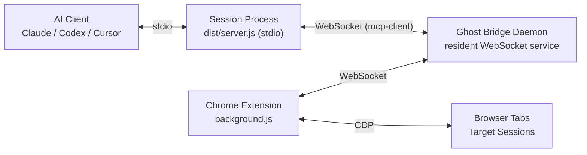

# 👻 Ghost Bridge

[](https://www.npmjs.com/package/ghost-bridge)
[](https://www.npmjs.com/package/ghost-bridge)
[](https://opensource.org/licenses/MIT)

> Zero-restart Chrome bridge for MCP clients. Let AI inspect, debug, and operate the browser session you are already using.

## Why

Most browser-capable AI tools start a separate browser. Ghost Bridge connects AI to your existing Chrome session instead, so it can work with the page state you already have: logged-in accounts, reproduced bugs, in-progress flows, network failures, and real UI state.

## What It Does

- Attach to Chrome without `--remote-debugging-port`
- Inspect page structure, text, screenshots, errors, and network traffic
- Search and extract script sources, even in production bundles
- Click, type, scroll, and submit forms on the current page
- Locate elements by role/name, label, placeholder, text, test ID, or CSS across open Shadow DOM and same-origin iframes
- Run `locate → act → wait → snapshot` as one browser call instead of model-driven polling
- Bind multiple Chrome tabs as named targets and operate them independently
- Share one Chrome transport across multiple MCP clients

## Quick Start

### 1. Install

```bash
npm install -g ghost-bridge
ghost-bridge init
```

`ghost-bridge init` currently writes config for:

- Claude Code: `~/.claude/settings.json` or `~/.claude.json`
- Codex: `~/.codex/config.toml`
- Cursor: `~/.cursor/mcp.json`
- Antigravity: `~/.gemini/antigravity/mcp.json`

If your MCP client is not auto-detected, add one of these manually.

JSON config:

```json
{
  "mcpServers": {
    "ghost-bridge": {
      "command": "/absolute/path/to/node",
      "args": ["/absolute/path/to/global/node_modules/ghost-bridge/dist/server.js"]
    }
  }
}
```

Codex TOML:

```toml
[mcp_servers.ghost-bridge]
type = "stdio"
command = "/absolute/path/to/node"
args = ["/absolute/path/to/global/node_modules/ghost-bridge/dist/server.js"]
```

### 2. Load the Extension

1. Open `chrome://extensions`
2. Enable Developer mode
3. Click `Load unpacked`
4. Select `~/.ghost-bridge/extension`

You can also run:

```bash
ghost-bridge extension --open
```

### 3. Connect

1. Click the Ghost Bridge extension icon
2. Click `Connect`
3. Wait until the status becomes `ON`
4. Open your MCP client and start working on the current page

Typical prompts:

- `Analyze the current page`
- `Check why this layout is broken`
- `Inspect the DOM structure`
- `Click the login button and submit the form`

## Tools

| Tool | Purpose |
|------|---------|
| `inspect_page` | Default entry point for page analysis |
| `capture_screenshot` | Visual inspection and UI debugging |
| `get_page_content` | Text, HTML, and structured DOM extraction |
| `get_interactive_snapshot` | Find clickable and editable elements |
| `dispatch_action` | Locate, act, wait, and verify in one call; supports semantic locators and batches |
| `eval_script` | Execute JavaScript, wait for returned promises, and cap arbitrary output |
| `page_request` | Send an authenticated page-context request and wait for the response in one call |
| `bind_tab` | Bind a Chrome tab as a named target such as `cases` or `app` |
| `unbind_tab` | Remove a named target binding |
| `list_targets` | Show named targets and their per-tab session status |
| `pin_current_tab` | Keep Ghost Bridge attached to the current tab while you browse elsewhere |
| `pin_tab` | Pin a target tab by tab ID, URL fragment, or title fragment |
| `unpin_tab` | Return to following the focused tab |
| `get_target_tab` | Show the current target mode and tab |
| `list_tabs` | List available Chrome tabs |
| `list_network_requests` | Inspect captured network traffic |
| `get_network_detail` | Read one request in detail |
| `get_last_error` | Inspect recent console, exception, and network error events |
| `get_script_source` | Extract page scripts |
| `find_by_string` | Search within bundled script content |
| `coverage_snapshot` | Identify active scripts quickly |
| `perf_metrics` | Collect Web Vitals and engine metrics |

Recommended flow:

1. When the target is describable, call `dispatch_action` directly with a semantic `locator`
2. Use `inspect_page` when the page is unfamiliar or a locator is ambiguous; its compact response includes actionable refs
3. Use `capture_screenshot` for visual issues
   Default is optimized for transfer with JPEG; switch to `png` for pixel-level checks
4. Use `get_page_content` for DOM or text extraction
5. Put consecutive fills/clicks into one `dispatch_action.actions` call; add `waitFor` to the action that changes state and `snapshotAfter` when the resulting UI is needed

Round-trip-efficient examples:

```json
{
  "target": "app",
  "actions": [
    {
      "locator": { "role": "textbox", "label": "Email" },
      "action": "fill",
      "value": "user@example.com"
    },
    {
      "locator": { "role": "textbox", "label": "Password" },
      "action": "fill",
      "value": "secret"
    },
    {
      "locator": { "role": "button", "name": "Sign in" },
      "action": "click",
      "waitFor": {
        "type": "element",
        "locator": { "text": "Signed in" },
        "state": "visible",
        "timeoutMs": 10000
      }
    }
  ],
  "snapshotAfter": true
}
```

Locator fields are `css`, `testId`, `role` + `name`, `label`, `placeholder`, `text`, `match`, and zero-based `nth`. Matching is exact by default. Ghost Bridge refuses ambiguous action targets and returns compact candidates instead of silently choosing the first element.

`waitFor` supports:

- `element`: `visible`, `hidden`, `attached`, `detached`, or `enabled`
- `url`: `contains` or `equals`
- `networkIdle`: optional `idleMs`
- `expression`: a truthy JavaScript expression, including a returned Promise

Polling happens inside the extension at a short interval, so it does not create repeated model/tool turns. Each condition defaults to 10 seconds and is capped at 30 seconds. The whole batch has a hard deadline of at most 60 seconds; once reached, remaining actions are not executed. Fixed `waitMs` remains for compatibility but defaults to zero.

For API calls that need the page's login state, prefer `page_request`. If custom asynchronous JavaScript is still needed, return the promise from `eval_script` instead of storing a result on `window` and polling it in another tool call:

```javascript
(async () => {
  const response = await fetch('/api/items', { credentials: 'include' })
  const data = await response.json()
  return data.items.map(({ id, name }) => ({ id, name }))
})()
```

Notes:

- Use `bind_tab` when a workflow spans multiple pages. For example, bind a checklist page as `cases` and a business page as `app`, then call tools with `target: "cases"` or `target: "app"`.
- All browser tools accept an optional `target` parameter. When named targets are bound, `dispatch_action` requires `target` so refs from one page are not accidentally used on another page.
- Semantic locators traverse open Shadow DOM and readable same-origin iframes. Cross-origin iframe DOM is not accessible and is skipped explicitly.
- `get_page_content` reports iframe counters and uses contiguous `offset`/`maxLength` slices, so pagination does not duplicate or skip the hidden middle of a head/tail truncation.
- Use `pin_current_tab` when you are debugging a page and need to switch to other tabs without changing the AI target. Use `unpin_tab` to restore the original follow-focused-tab behavior.
- `list_network_requests` and `get_network_detail` automatically summarize `data:` URLs and very long URLs so inline images or oversized query strings do not overwhelm model context

Multi-page example:

```text
Bind the current checklist tab as cases.
Bind the tab whose title contains "Orders" as app.
Read the next case from target cases, operate target app, then mark the case passed or failed back on target cases.
```

## Configuration

| Setting | Default | Notes |
|---------|---------|-------|
| Port | `33333` | Set `GHOST_BRIDGE_PORT` to override |
| Token | Monthly UUID | Set `GHOST_BRIDGE_TOKEN` to override |
| Auto detach | `false` | Keeps debugger attached for ongoing capture |

## Architecture


```mermaid
flowchart LR
    A["AI Client<br/>Claude / Codex / Cursor"]
    S["Session Process<br/>dist/server.js (stdio)"]
    B["Ghost Bridge Daemon<br/>resident WebSocket service"]
    C["Chrome Extension<br/>background.js"]
    D["Browser Tabs<br/>Target Sessions"]

    A <-->|"stdio"| S
    S <-->|"WebSocket (mcp-client)"| B
    C <-->|"WebSocket"| B
    C <-->|"CDP"| D
```

The WebSocket service runs as a detached daemon, independent of any MCP session:

- The first session process spawns the daemon automatically; it keeps running after that session exits
- If the daemon crashes, any live session detects it and respawns it automatically
- Stop it manually with `ghost-bridge stop` (close live MCP sessions first, otherwise they will bring it back on their next reconnect)

## Troubleshooting

If the popup shows `No Bridge` / `Not Found`, it means the Chrome extension could not find a Ghost Bridge WebSocket service on the configured port. With the resident daemon this normally only happens before the first MCP session of the day starts, or after `ghost-bridge stop`. Starting any MCP session (or reconnecting the extension) brings the service back within seconds.

Run `ghost-bridge status` and check:

- `Active WebSocket Service`: the running server path should match the CLI/package you expect
- `Chrome Extension > Sync`: the installed extension should match the current package

If either is out of sync, run `ghost-bridge init`, reload the Chrome extension, and restart the MCP client so the browser, extension copy, and server process all point at the same build.

## Limitations

- Chrome DevTools on the target tab can conflict with `chrome.debugger.attach`
- MV3 background lifecycle can still cause reconnect scenarios after long idle periods
- Very large minified bundles may be truncated during beautify or extraction
- Deep cross-origin iframe cases are not fully covered yet

## License

[MIT](LICENSE)
